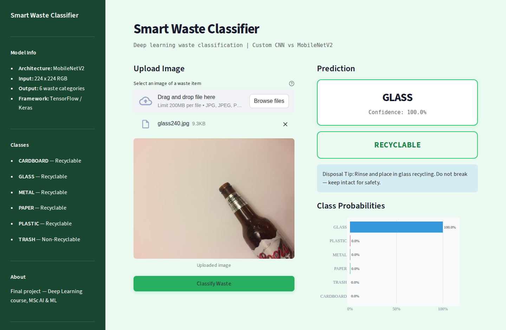
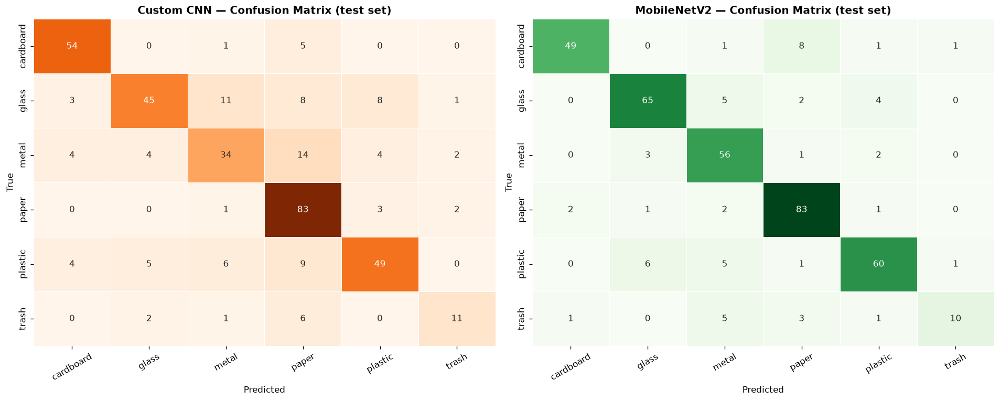
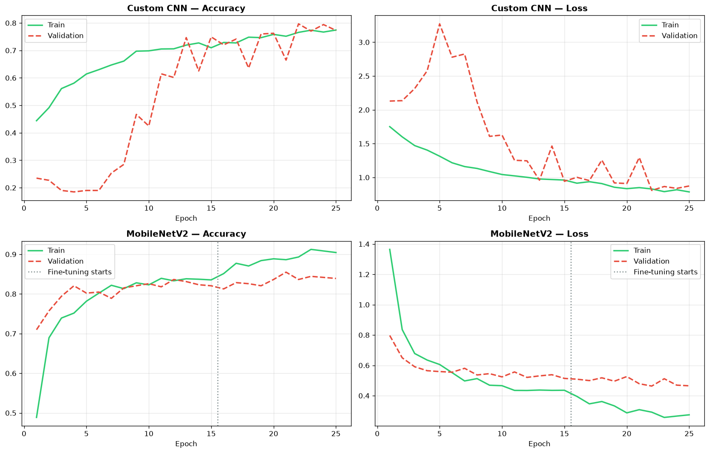
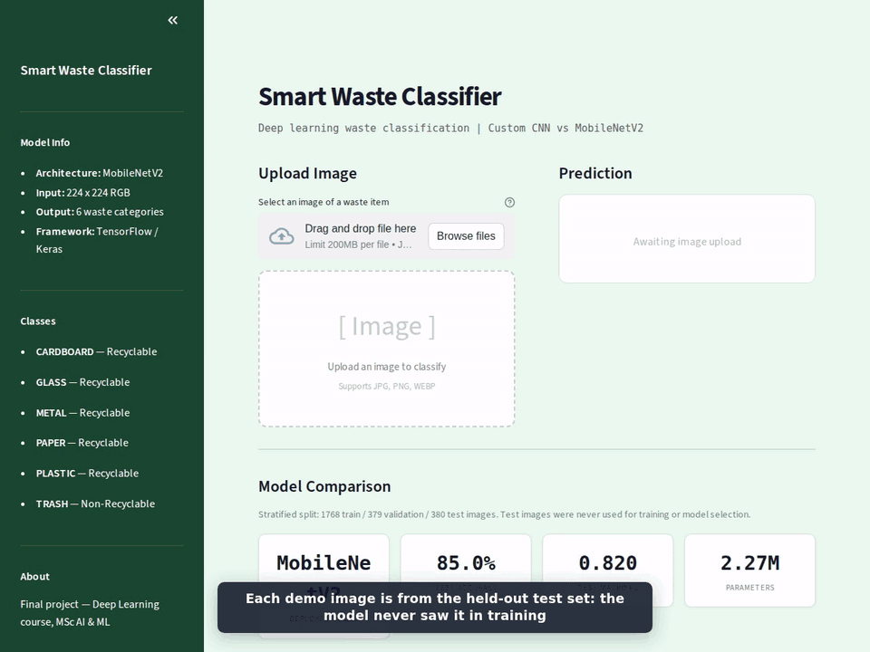

# Smart Waste Classifier

A deep learning system that classifies garbage images into 6 waste categories and determines whether the item is recyclable or non-recyclable. It compares a custom CNN trained from scratch with MobileNetV2 transfer learning, and serves the better model in a Streamlit app.

Built as the final project for the Deep Learning course of the MSc in Artificial Intelligence & Machine Learning. The course labs are in [`DeepLearning/`](DeepLearning/).




---

## Problem Statement

Improper waste disposal is a critical environmental challenge. Manual sorting of garbage is slow, inconsistent, and unsustainable at scale. This system automates waste classification from images, enabling smart bin deployment and automated recycling pipelines.

- **Input:** RGB image of a waste item (224x224x3)
- **Output:** One of 6 waste categories — Cardboard, Glass, Metal, Paper, Plastic, Trash
- **Task Type:** Multi-class Image Classification (Supervised Learning)
- **Real-world Impact:** Supports SDG Goal 12 — Responsible Consumption and Production

---

## Models

Two models were trained and compared on the same data split.

**1. Custom CNN (baseline)**, trained from scratch with TensorFlow/Keras:

| Layer | Type | Filters / Units | Activation | Regularization |
|---|---|---|---|---|
| Block 1 | Conv2D + BatchNorm + MaxPool | 32 | ReLU | L2 = 0.001 |
| Block 2 | Conv2D + BatchNorm + MaxPool | 64 | ReLU | L2 = 0.001 |
| Block 3 | Conv2D + BatchNorm + MaxPool | 128 | ReLU | L2 = 0.001 |
| Block 4 | Conv2D + BatchNorm + MaxPool | 256 | ReLU | L2 = 0.001 |
| Head | GlobalAveragePooling2D | — | — | — |
| Dense 1 | Dense + Dropout | 512, p=0.5 | ReLU | Dropout |
| Dense 2 | Dense + Dropout | 256, p=0.3 | ReLU | Dropout |
| Output | Dense | 6 | Softmax | — |

654,790 parameters · Categorical cross-entropy · Adam (lr = 0.001)

**2. MobileNetV2 (transfer learning)**, the deployed model:

- MobileNetV2 base pretrained on ImageNet, followed by GlobalAveragePooling → Dropout(0.3) → Dense(6, Softmax)
- **Phase 1:** base frozen, only the new head is trained (lr = 1e-3)
- **Phase 2:** top 40 base layers fine-tuned at lr = 1e-5, with BatchNorm layers kept frozen
- 2,265,670 parameters; the model rescales inputs internally, so it takes the same [0, 1] images as the CNN

Both models use the same augmentation (flips, ±20° rotation, ±20% shift and zoom), early stopping on validation loss and learning-rate reduction on plateau.

---

## Results

The data is split **70% train / 15% validation / 15% test**, stratified by class. The validation set is used for early stopping and for choosing between the models; the **test set is used only once**, for the numbers below.

| Model | Val. accuracy | **Test accuracy** | Test macro F1 |
|---|---|---|---|
| Custom CNN | 79.7% | **72.6%** | 0.706 |
| **MobileNetV2** | 83.6% | **85.0%** | **0.820** |

**Per-class F1 on the test set:**

| Class | Custom CNN | MobileNetV2 | Test images |
|---|---|---|---|
| Cardboard | 0.864 | 0.875 | 60 |
| Glass | 0.682 | 0.861 | 76 |
| Metal | 0.586 | 0.824 | 62 |
| Paper | 0.776 | 0.888 | 89 |
| Plastic | 0.715 | 0.845 | 73 |
| Trash | 0.611 | 0.625 | 20 |





**Key findings**

- Transfer learning improves test accuracy by **12.4 points** (72.6% → 85.0%). The largest gains are on glass, metal and plastic, which differ in subtle surface properties such as transparency and reflections.
- Fine-tuning the top of MobileNetV2 lowered the best validation loss from 0.514 to 0.463.
- The custom CNN scored 79.7% on validation but 72.6% on test. Its validation curve is noisy, so the epoch chosen by early stopping partly reflects luck on the validation set, which is why the final numbers come from a separate test set.
- **Trash is the weakest class** for both models (F1 ≈ 0.6). It has only 137 images in total, and MobileNetV2 most often confuses it with metal or paper.

> An earlier version of this project reported 70.58% *validation* accuracy with an 80/20 split, where the same validation set was also used for early stopping. The results above replace it.

---

## Project Structure

```
WasteClassifier/
├── DL_ModelTraining.ipynb     # Training notebook: data split, both models, evaluation
├── app.py                     # Streamlit UI application
├── garbage_classifier.keras   # Deployed model (MobileNetV2), native Keras format
├── class_names.json           # Class label mapping
├── training_history.json      # Test metrics and training curves for both models
├── results/                   # Confusion matrices, training curves, app screenshot and demo
└── requirements.txt           # Pinned dependencies for the app
```

---

## Dataset

**Garbage Classification Dataset** — Kaggle  
- 2527 labeled images across 6 waste categories  
- Source: https://www.kaggle.com/datasets/asdasdasasdas/garbage-classification  
- Split: 70% training (1,768) / 15% validation (379) / 15% test (380), stratified by class
- Imbalanced: trash has 137 images, paper has 594

---

## How to Run the Streamlit App

**1. Clone the repository**
```bash
git clone https://github.com/HudaManiyar/Smart-Waste-Classifier.git
cd Smart-Waste-Classifier/WasteClassifier
```

**2. Create and activate a virtual environment**
```bash
python -m venv dl_env
dl_env\Scripts\activate        # Windows
source dl_env/bin/activate     # Mac/Linux
```

**3. Install dependencies**
```bash
pip install -r requirements.txt
```

**4. Run the app**
```bash
streamlit run app.py
```

**5. Open in browser**
```
http://localhost:8501
```

---

## UI Features

- Upload any image of a waste item
- Displays predicted waste category with confidence percentage
- Shows whether the item is **Recyclable** or **Non-Recyclable**
- Displays a confidence bar chart across all 6 classes
- Shows a disposal tip for the predicted category
- Compares both models on the test set (accuracy, macro F1, per-class F1)
- Interactive training history plots for each model

---

## Demo

The app classifying four images from the held-out test set:



[Full demo video (MP4, 55 s)](WasteClassifier/results/demo.mp4): predictions, model comparison and training curves.

---

## Future Improvements

- K-fold cross-validation for a more stable estimate (the test set has only 20 trash images)
- Class weighting or more trash images to improve the weakest class
- Deploy the Streamlit app publicly

---

## Deep Learning Labs

The [`DeepLearning/`](DeepLearning/) folder contains the practical exercises from the Deep Learning course (MSc Artificial Intelligence & Machine Learning), each with its own README explaining the method and results:

- **Lab 1:** Multi-Layer Perceptron for XOR in Keras, PyTorch and TensorFlow
- **Lab 2:** Deep feedforward network on Fashion-MNIST, with depth and activation experiments
- **Lab 3:** L1, L2 and Elastic Net regularisation
- **Lab 4:** CNN from scratch; YOLOv5 vs YOLOv8 object detection with a Weighted Box Fusion ensemble
- **Lab 5:** Next-word text generation with RNN and LSTM
- **Lab 6:** Sparse autoencoder on CIFAR-10
- **Lab 7:** Variational autoencoder on MNIST

---

## Tech Stack


The notebook runs on Google Colab (GPU recommended). The saved outputs in the notebook come from a CPU run with TensorFlow 2.19.
